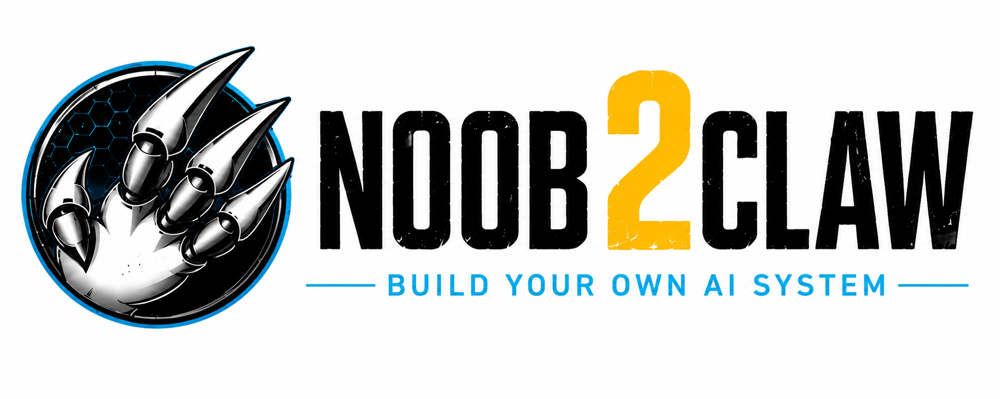

<p align="center">
  
</p>

<h1 align="center">Noob2Claw – Agentic Webinterface Starter Kit</h1>

<p align="center">
Von der Idee zum fertigen Webinterface – entwickelt mit KI.
</p>

<p align="center">
  🌐 <a href="https://noob2claw.de/"><strong>noob2claw.de</strong></a>
</p>

---

# 🚀 Was ist Noob2Claw?

**Noob2Claw** ist eine vollständige Entwicklungsgrundlage für ein modernes, KI-gestütztes Webinterface.

Anstatt einer KI nur einen einzelnen Prompt zu geben, erhält sie eine komplette Softwarearchitektur mit verbindlichen Regeln.

Die Markdown-Dokumentation dient als Wissensbasis für KI-Agenten wie **OpenClaw**, damit diese ein vollständiges PHP-/MariaDB-System selbstständig entwickeln können.

---

# 🎯 Ziel des Projekts

Dieses Repository liefert keine fertige Anwendung, sondern eine komplette Entwicklungsgrundlage.

Die KI arbeitet auf Basis von:

- Projektarchitektur
- Verzeichnisstruktur
- Datenbankschema
- Coding Rules
- API- und MCP-Konzept
- Benutzer- und Rechteverwaltung
- UI- und Designsystem
- CSS-Standards
- Formular- und Tabellenstandards
- zentralem Startprompt

Dadurch entstehen deutlich konsistentere und wartbarere Projekte.

---

# 📦 Inhalt

Das Repository enthält unter anderem:

- Grundentwicklung
- Verzeichnisstruktur
- Datenbankschema
- Coding Rules
- Seitenaufbau
- Navigation
- API & MCP
- Benutzer & Rechte
- Module & Funktionen
- Dashboard
- Core-Datenbank
- Einstellungen
- Design-System
- CSS-Standards
- Formular-Standards
- Tabellen-Standards
- Startprompt
- Lizenz

---

# 🛠 Technologien

- PHP
- MariaDB
- Apache
- HTML
- CSS
- JavaScript
- OpenClaw
- MCP (Model Context Protocol)
- REST API

Es wird bewusst auf große Frameworks verzichtet.

---

# 🧠 Entwicklungsprinzip

```text
Markdown-Dokumentation
            │
            ▼
       OpenClaw
            │
            ▼
      PHP + MariaDB
            │
            ▼
Lauffähiges Webinterface
```

---

# 🎥 Noob2Claw Videoserie

Die komplette Entstehung dieses Projekts wird Schritt für Schritt auf YouTube dokumentiert.

In der Serie zeige ich unter anderem:

- Installation von OpenClaw
- Aufbau der Entwicklungsumgebung
- Erstellung der Architektur
- Entwicklung mit KI
- Vibe Coding
- Agentic Workflows
- REST API
- MCP
- Aufbau eines vollständigen Webinterfaces

👉 **Playlist:**

https://www.youtube.com/watch?v=ZckcAkLHFVw&list=PL2Bg_doUPbASMUDKYPnMlysRYmUlJJ9NP

---

# 🤝 Mitmachen

Verbesserungen sind jederzeit willkommen.

Wenn dir das Projekt gefällt, freue ich mich über:

- ⭐ Star auf GitHub
- 🍴 Fork
- 🛠 Pull Request
- 💬 Feedback
- 📺 Abo auf YouTube

---

# 📄 Lizenz

Siehe:

```text
LICENSE.md
```

Kurzfassung:

Bei Forks, die Dritten zugänglich gemacht werden, und bei jeder Weitergabe an Dritte sind die Namensnennung von **Mario Alka** und der Erhalt des Lizenzhinweises erforderlich.

- ✅ Freie private und interne Nutzung
- ✅ Änderungen und Erweiterungen erlaubt
- ✅ Eigene Projekte dürfen darauf aufbauen
- ℹ️ Bei öffentlichem Content oder kommerziellen Projekten ist eine Namensnennung von **Mario Alka** erforderlich.
- ℹ️ Forks und andere Weitergaben sind erlaubt. Dabei müssen der Lizenzhinweis erhalten bleiben und **Mario Alka** als ursprünglicher Autor beziehungsweise Quelle genannt werden.
- ℹ️ Sonst keine Einschränkungen bei der Nutzung auch bei kommerziellen Projekten

---

# ℹ️ Hinweis

Dieses Repository ist **kein fertiges Framework**.

Es ist eine dokumentationsgetriebene Entwicklungsbasis, mit der KI-Agenten wie OpenClaw hochwertige Software nach festen Standards entwickeln können.
